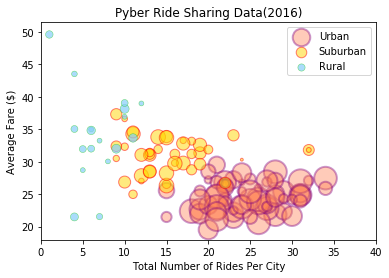
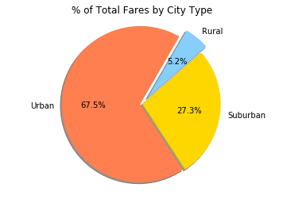
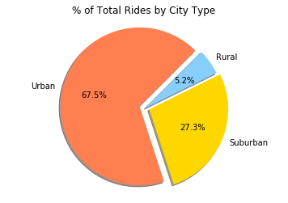
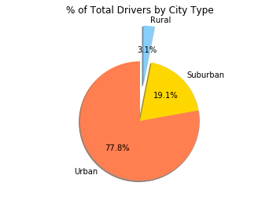

The ride sharing bonanza continues! Seeing the success of notable players like Uber and Lyft, you've decided to join a fledgling ride sharing company of your own. In your latest capacity, you'll be acting as Chief Data Strategist for the company. In this role, you'll be expected to offer data-backed guidance on new opportunities for market differentiation.

You've since been given access to the company's complete recordset of rides. This contains information about every active driver and historic ride, including details like city, driver count, individual fares, and city type.

Your objective is to build a Bubble Plot that showcases the relationship between four key variables:

*Average Fare ($) Per City

*Total Number of Rides Per City

*Total Number of Drivers Per City

*City Type (Urban, Suburban, Rural)

In addition, you will be expected to produce the following three pie charts:

1. % of Total Fares by City Type

2. % of Total Rides by City Type

3. % of Total Drivers by City Type

As final considerations:

You must use the Pandas Library and the Jupyter Notebook.
You must use the Matplotlib and Seaborn libraries.
You must include a written description of three observable trends based on the data.
You must use proper labeling of your plots, including aspects like: Plot Titles, Axes Labels, Legend Labels, Wedge Percentages, and Wedge Labels.
Remember when making your plots to consider aesthetics!
You must stick to the Pyber color scheme (Gold, Light Sky Blue, and Light Coral) in producing your plot and pie charts.
When making your Bubble Plot, experiment with effects like alpha, edgecolor, and linewidths.
When making your Pie Chart, experiment with effects like shadow, startangle, and explosion.
You must include an exported markdown version of your Notebook called  README.md in your GitHub repository.
See Example Solution for a reference on expected format.


```python
#Importing dependencies
import matplotlib.pyplot as plt
import pandas as pd
import numpy as np
import os
```


```python
# Reading csv files
csvpath1 = os.path.join('raw_data', 'city_data.csv')
csvpath2 = os.path.join('raw_data', 'ride_data.csv')
city_df = pd.read_csv(csvpath1)
ride_df = pd.read_csv(csvpath2)


city_df.head()
ride_df.head()
```


<div>
<style scoped>
    .dataframe tbody tr th:only-of-type {
        vertical-align: middle;
    }

    .dataframe tbody tr th {
        vertical-align: top;
    }

    .dataframe thead th {
        text-align: right;
    }
</style>
<table border="1" class="dataframe">
  <thead>
    <tr style="text-align: right;">
      <th></th>
      <th>city</th>
      <th>date</th>
      <th>fare</th>
      <th>ride_id</th>
    </tr>
  </thead>
  <tbody>
    <tr>
      <th>0</th>
      <td>Sarabury</td>
      <td>2016-01-16 13:49:27</td>
      <td>38.35</td>
      <td>5403689035038</td>
    </tr>
    <tr>
      <th>1</th>
      <td>South Roy</td>
      <td>2016-01-02 18:42:34</td>
      <td>17.49</td>
      <td>4036272335942</td>
    </tr>
    <tr>
      <th>2</th>
      <td>Wiseborough</td>
      <td>2016-01-21 17:35:29</td>
      <td>44.18</td>
      <td>3645042422587</td>
    </tr>
    <tr>
      <th>3</th>
      <td>Spencertown</td>
      <td>2016-07-31 14:53:22</td>
      <td>6.87</td>
      <td>2242596575892</td>
    </tr>
    <tr>
      <th>4</th>
      <td>Nguyenbury</td>
      <td>2016-07-09 04:42:44</td>
      <td>6.28</td>
      <td>1543057793673</td>
    </tr>
  </tbody>
</table>
</div>


```python

#Calculate
# *Average Fare ($) Per City

# *Total Number of Rides Per City

# *Total Number of Drivers Per City

# *City Type (Urban, Suburban, Rural)


ride_groupby= ride_df.groupby("city")
ride_groupby.count()

average_fare_city= ride_groupby["fare"].mean()
total_fare_city= ride_groupby["fare"].sum()
rides_per_city= ride_groupby["ride_id"].count()


summary_table1 = pd.DataFrame({"city":average_fare_city.keys(),
                               "average_fare": average_fare_city.values,
                               "total_fare" : total_fare_city.values,
                               "total_rides": rides_per_city.values})

city_data = pd.merge(city_df ,summary_table1, how="left", on='city')
city_data.dropna(how="any")
city_data.head()


# Format for percentages
#merged_df["% Recommend"] = merged_df["% Recommend"].map("{0:,.2f}%".format)

```


<div>
<style scoped>
    .dataframe tbody tr th:only-of-type {
        vertical-align: middle;
    }

    .dataframe tbody tr th {
        vertical-align: top;
    }

    .dataframe thead th {
        text-align: right;
    }
</style>
<table border="1" class="dataframe">
  <thead>
    <tr style="text-align: right;">
      <th></th>
      <th>city</th>
      <th>driver_count</th>
      <th>type</th>
      <th>average_fare</th>
      <th>total_fare</th>
      <th>total_rides</th>
    </tr>
  </thead>
  <tbody>
    <tr>
      <th>0</th>
      <td>Kelseyland</td>
      <td>63</td>
      <td>Urban</td>
      <td>21.806429</td>
      <td>610.58</td>
      <td>28</td>
    </tr>
    <tr>
      <th>1</th>
      <td>Nguyenbury</td>
      <td>8</td>
      <td>Urban</td>
      <td>25.899615</td>
      <td>673.39</td>
      <td>26</td>
    </tr>
    <tr>
      <th>2</th>
      <td>East Douglas</td>
      <td>12</td>
      <td>Urban</td>
      <td>26.169091</td>
      <td>575.72</td>
      <td>22</td>
    </tr>
    <tr>
      <th>3</th>
      <td>West Dawnfurt</td>
      <td>34</td>
      <td>Urban</td>
      <td>22.330345</td>
      <td>647.58</td>
      <td>29</td>
    </tr>
    <tr>
      <th>4</th>
      <td>Rodriguezburgh</td>
      <td>52</td>
      <td>Urban</td>
      <td>21.332609</td>
      <td>490.65</td>
      <td>23</td>
    </tr>
  </tbody>
</table>
</div>


```python
urban_data = city_data.loc[city_data["type"] == "Urban",:]
suburban_data = city_data.loc[city_data["type"] == "Suburban",:]
rural_data = city_data.loc[city_data["type"] == "Rural",:]
max_total_rides = city_data["total_rides"].max()

urban_data.head()
suburban_data.head()
rural_data.head()

```


<div>
<style scoped>
    .dataframe tbody tr th:only-of-type {
        vertical-align: middle;
    }

    .dataframe tbody tr th {
        vertical-align: top;
    }

    .dataframe thead th {
        text-align: right;
    }
</style>
<table border="1" class="dataframe">
  <thead>
    <tr style="text-align: right;">
      <th></th>
      <th>city</th>
      <th>driver_count</th>
      <th>type</th>
      <th>average_fare</th>
      <th>total_fare</th>
      <th>total_rides</th>
    </tr>
  </thead>
  <tbody>
    <tr>
      <th>108</th>
      <td>South Elizabethmouth</td>
      <td>3</td>
      <td>Rural</td>
      <td>28.698000</td>
      <td>143.49</td>
      <td>5</td>
    </tr>
    <tr>
      <th>109</th>
      <td>East Troybury</td>
      <td>3</td>
      <td>Rural</td>
      <td>33.244286</td>
      <td>232.71</td>
      <td>7</td>
    </tr>
    <tr>
      <th>110</th>
      <td>Kinghaven</td>
      <td>3</td>
      <td>Rural</td>
      <td>34.980000</td>
      <td>209.88</td>
      <td>6</td>
    </tr>
    <tr>
      <th>111</th>
      <td>New Johnbury</td>
      <td>6</td>
      <td>Rural</td>
      <td>35.042500</td>
      <td>140.17</td>
      <td>4</td>
    </tr>
    <tr>
      <th>112</th>
      <td>Erikport</td>
      <td>3</td>
      <td>Rural</td>
      <td>30.043750</td>
      <td>240.35</td>
      <td>8</td>
    </tr>
  </tbody>
</table>
</div>


```python
# building bubble plots
# Change color with c and alpha. I map the color to the X axis value. 


# The colors of each section of the pie chart
labels = ('Urban', 'Suburban', 'Rural')
colors = ["coral","gold", "lightskyblue"]


urban = plt.scatter(x = urban_data['total_rides'], y = urban_data['average_fare'], s = urban_data['driver_count'] * 8, c=colors[0] , alpha=0.4, edgecolors="purple", linewidth=2)
suburban = plt.scatter(x = suburban_data['total_rides'], y = suburban_data['average_fare'] , s= suburban_data['driver_count'] * 8, c=colors[1] , alpha=0.5, edgecolors="red", linewidth=1)
rural = plt.scatter(x = rural_data['total_rides'], y = rural_data['average_fare'] , s= rural_data['driver_count'] * 8, c=colors[2] , alpha=0.7, edgecolors="limegreen", linewidth=0.5)

plt.xlim(0, max_total_rides + 6)
plt.title("Pyber Ride Sharing Data(2016)")
plt.xlabel("Total Number of Rides Per City") 
plt.ylabel("Average Fare ($)") 
plt.legend((urban, suburban, rural), labels, loc="best", fancybox=True)
plt.show()
plt.savefig("pyber_bubbleplot.png")
 
```





    <matplotlib.figure.Figure at 0x931fef0>


```python
total_fares = ride_df['fare'].sum()


total_fare_urban = urban_data["total_fare"].sum()
total_fare_suburban = suburban_data["total_fare"].sum()
total_fare_rural = rural_data["total_fare"].sum()

percentage_fare_urban= (total_fare_urban / total_fares) * 100
percentage_fare_suburban= (total_fare_suburban / total_fares) * 100
percentage_fare_rural= (total_fare_rural / total_fares) * 100
```


```python
#1.Plotting % of Total Fares by City Type
percentages_fare=[percentage_fare_urban, percentage_fare_suburban, percentage_fare_rural]
explode = [0.03, 0.0, 0.1]
plt.title("% of Total Fares by City Type")
plt.pie(percentages_plot, explode=explode, labels=labels, colors=colors,
        autopct="%1.1f%%", shadow=True, startangle=60)
plt.axis("equal")
plt.show()
plt.savefig("pyber_totalfare_plot.png")
 
```





    <matplotlib.figure.Figure at 0xaea83c8>


```python

total_rides = city_data["total_rides"].sum()

total_rides_urban = urban_data["total_rides"].sum()
percentage_rides_urban = (total_rides_urban / total_rides) * 100

total_rides_suburban = suburban_data["total_rides"].sum()
percentage_rides_suburban = (total_rides_suburban / total_rides) * 100

total_rides_rural = rural_data["total_rides"].sum()
percentage_rides_rural = (total_rides_rural / total_rides) * 100


```


```python

#2.Plotting % of Total Rides by City Type
percentages_rides=[percentage_rides_urban, percentage_rides_suburban, percentage_rides_rural]
explode = [0.08, 0.05, 0]
plt.title("% of Total Rides by City Type")
plt.pie(percentages_rides, explode=explode, labels=labels, colors=colors,
        autopct="%1.1f%%", shadow=True, startangle=45)
plt.axis("equal")
plt.show()
plt.savefig("pyber_totalrides_plot.png")
```





    <matplotlib.figure.Figure at 0xadb56d8>


```python
total_driver_count = city_data['driver_count'].sum()

total_drivers_urban = urban_data["driver_count"].sum()
total_drivers_suburban = suburban_data["driver_count"].sum()
total_drivers_rural = rural_data["driver_count"].sum()

percentage_drivers_urban= (total_drivers_urban / total_driver_count) * 100
percentage_drivers_suburban= (total_drivers_suburban / total_driver_count) * 100
percentage_drivers_rural= (total_drivers_rural / total_driver_count) * 100
```


```python
#3.% of Total Drivers by City Type

percentages_drivers=[percentage_drivers_urban, percentage_drivers_suburban, percentage_drivers_rural]
explode = [0.0, 0.0, 0.6]
plt.title("% of Total Drivers by City Type")
plt.pie(percentages_drivers, explode=explode, labels=labels, colors=colors,
        autopct="%1.1f%%", shadow=True, startangle=90)
plt.axis("equal")
plt.show()
plt.savefig("pyber_totaldrivers_plot.png")
```





# Three observable trends from the Pyber exercise

1. The Average Fare to rural areas is more than in suburban or urban areas.
2. There are more drivers on Urban than in suburban or rural areas.
3. More rides are taken to Urban and Suburban areas than to rural.

