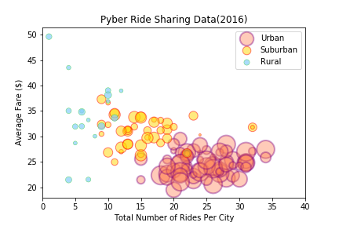
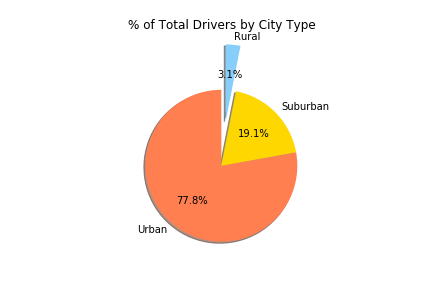
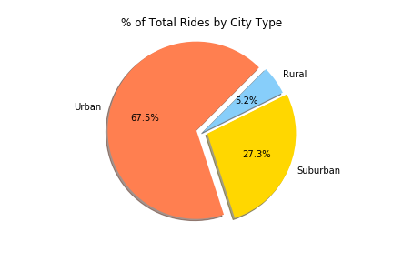

# Three observable trends from the Pyber exercise

1. The Average Fare to rural areas is more than in suburban or urban areas

2. There are more drivers on Urban than in suburban or rural areas.

3. More rides are taken to Urban and Suburban areas than to rural
